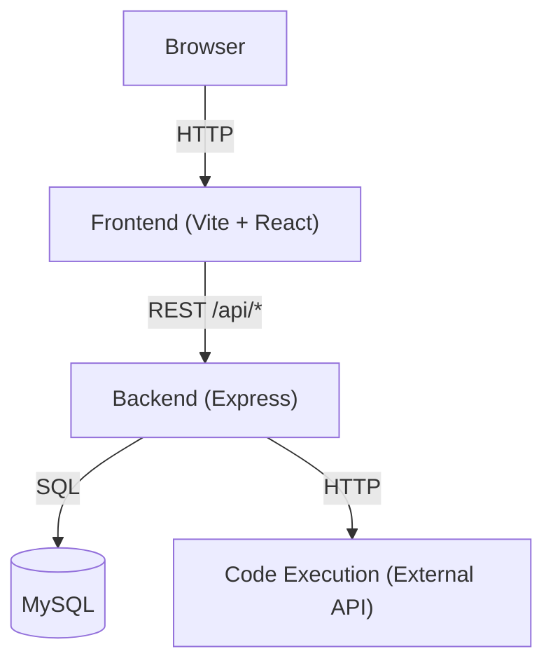

# architecture.md

## System Architecture



## Components

| Component | Tech Stack | Role |
|-----------|-----------|------|
| Frontend | React 19, React Router v7, Monaco Editor, Vite | SPA. Page routing, code editor UI, API communication |
| Backend  | Node.js, Express, JWT, bcrypt | REST API server. Auth, code storage/retrieval, code execution proxy |
| DB       | MySQL (mysql2) | Persistent storage for users and code snippets |

## Communication

- Frontend → Backend: `fetch('/api/...')` — JWT Bearer token auth
- Backend → DB: mysql2 direct queries (no ORM)
- Backend → External: axios for code execution API calls

## Directory Structure

```
/
├── client/          # Frontend
│   └── src/
│       ├── pages/
│       ├── components/
│       ├── contexts/
│       ├── hooks/
│       ├── styles/
│       ├── utils/
│       └── __tests__/
└── server/          # Backend
    └── src/
        ├── routes/
        ├── controllers/
        ├── models/
        ├── middlewares/
        ├── config/
        └── __tests__/
```
